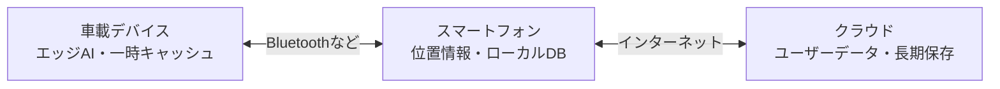

# ElectricSheep


> 人生最後のドライブを、これまでの思い出とこれからの願いで彩る車載AI。

## プロジェクト概要

ElectricSheepは、2026年度にメ〜テレが主催するハッカソン「Electric Sheep」に、チーム「バグばっかバックパッカー」として参加するためのプロジェクトです。

ハッカソンで提示されたテーマは、次の2つです。

- ハードウェアと連携すること
- 100歳になった自分を幸せにするプロダクトであること

私たちは「やりたいことをすべてやり、歩んできた人生を思い出せること」が、100歳の自分の幸せにつながると考えました。そこにチームの車への愛を掛け合わせ、行きたい場所と訪れた場所、道中の会話や気持ちを記録し、いつか迎える「人生最後のドライブ」を支える車載AIを開発します。

## コンセプト

**行きたい場所をすべて巡り、思い出とともに人生最後のドライブを設計する。**

```text
やりたいことをすべてやる
        ↓
行きたい場所をすべて訪れる
        ↓
訪れた場所や道中の思い出を残す
        ↓
人生最後のドライブにつなげる
```

将来、自動運転が一般的になれば、年齢を重ねて自分で運転することが難しくなっても、AIと一緒に思い出の場所を巡ることができます。本プロダクトは、その未来に向けて一人ひとりのドライブの記憶を蓄積します。

## 主な機能

### 車載AIとの対話

- 車のシガーソケットなどから電源を取り、乗車中にAIと自然な会話ができる
- 「今日どこへ行く？」「次はどこへ行きたい？」といった会話を通じて予定や希望を記録する
- 通信環境が不安定な場所でも、典型的な会話にはエッジAIが素早く応答する

### ドライブの記録

- スマートフォンから位置情報を取得し、訪れた場所を記録する
- いつ、誰と、どこへ行ったか、何回訪れたかを残す
- 車内での会話やそのときの気分をAIが要約し、ドライブの思い出として保存する
- 予定外の寄り道や、そこで見つけたものも記録する

### 行きたい場所の管理

- 会話に登場した「いつか行きたい場所」をリストへ追加する
- お気に入り、訪問履歴、行きたい場所などのカテゴリーに分けて管理する
- 予定に余裕があるとき、AIが行きたい場所や思い出の場所を提案する

### 思い出の振り返り

蓄積したデータをもとに、AIがドライブにまつわる記憶を自然な会話で呼び起こします。

- 「ちょうど1年前の今日は、こんな場所へ行ったね」
- 「ここに来るのは今回で3回目だね」
- 「以前ここへ寄り道したとき、意外なものを見つけたね」

## 利用イメージ

1. 車に乗ると、車載デバイスがスマートフォンと接続する
2. AIとの会話から、その日の目的地や行きたい場所を記録する
3. 位置情報と会話を組み合わせ、ドライブ中の出来事や気分を思い出として保存する
4. 次のドライブで、過去の記録や行きたい場所をAIが提案する
5. 長年蓄積した記録をもとに、人生最後のドライブを設計する

## システム構成

車内では通信状況が変化しやすく、クラウドだけに依存するとAIの返答が遅れ、会話が不自然になる可能性があります。そこで、データをクラウド、スマートフォン、車載デバイスの3層に分け、時間的・空間的な近さに応じて使い分けます。



| 層 | 主な役割 |
| --- | --- |
| 車載デバイス | 会話、即時応答、直近データの一時保持 |
| スマートフォン | 位置情報の取得、車載デバイスとのローカル通信、必要なデータの保持 |
| クラウド | ユーザーデータや長期的な思い出の保存・同期 |

クラウドへ接続できない場合も、車載デバイスが近くのスマートフォンにBluetoothなどでアクセスすることで、応答性と可用性を保ちます。

## ハードウェア連携

会話機能を備えた車載デバイスとして、Raspberry PiなどのエッジAI端末を利用する想定です。

ユーザーからの呼びかけには、会話のテンポを損なわず、できる限り速く応答する必要があります。典型的なやり取りをエッジ側で処理することで、クラウドAIへの通信回数と遅延を減らし、通信環境が悪い場所でも自然な会話を継続できるようにします。

## 記録するデータ

- 訪問日時と場所
- 同行者
- 訪問回数
- 行きたい場所とお気に入りの場所
- 車内での会話の要約
- 会話から読み取った、そのときの気分
- 寄り道や印象に残った出来事

## プライバシーへの配慮

本プロダクトは位置情報や車内の会話など、慎重な取り扱いが必要なデータを扱います。実装時には、録音・記録状態をユーザーが明確に把握して停止できる設計、必要最小限のデータ保存、暗号化、アクセス制御、保存期間の設定、記録に関わる同乗者の同意を重視します。

## 目指す未来

この車載AIは、単なる移動履歴の記録装置ではありません。何気ない会話や寄り道、その日の気持ちまで残し、時間が経ってから大切な思い出として返してくれる相棒です。

100歳になったとき、「行きたかった場所には全部行けた」と思えること。そして人生最後のドライブを、これまで積み重ねた記憶とともに楽しめること。それがElectricSheepの目標です。

---
これは2026年度メ〜テレ主催のハッカソンであるElectricSheepの1グループである、バグばっかバックパッカーのリポジトリである
メンバー：
黒川義高
鈴木悠介

